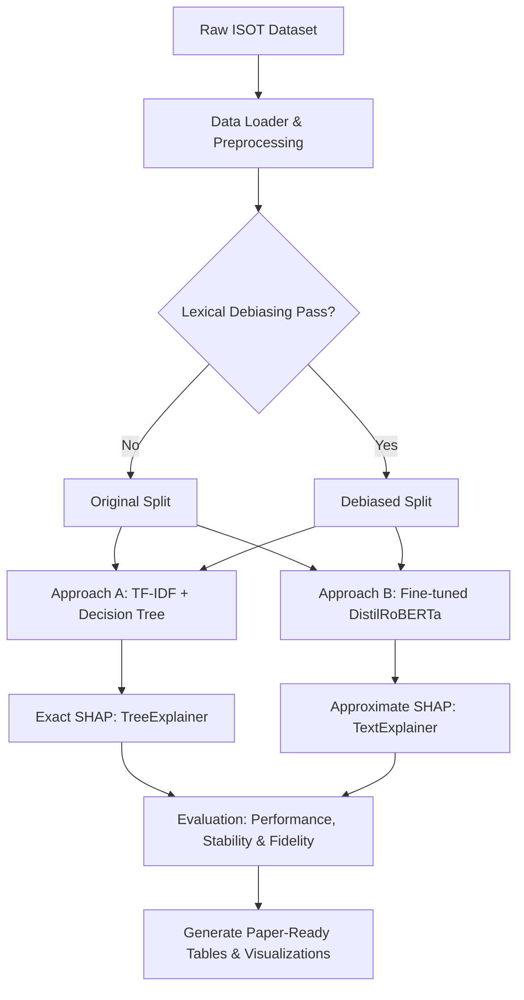

# White-Box vs. Black-Box Fake News Detection: An Explainability Comparison Using SHAP

[](https://www.python.org/)
[](LICENSE)
[](https://pytorch.org/)
[](https://github.com/shap/shap)

An explainability and performance benchmarking suite comparing interpretable white-box models (Decision Trees) and complex black-box architectures (DistilRoBERTa) for automated fake news detection. Utilizing the game-theoretic framework of **SHAP (SHapley Additive exPlanations)**, this project evaluates classifiers across three dimensions: classification performance, explanation stability, and explanation fidelity. It also features a lexical debiasing pass to address dataset leakage artifacts.

For a detailed analysis of the methodology, evaluation, and experimental findings, please refer to the project report in [report.tex](report.tex).

---

## Table of Contents

- [What the Project Does](#what-the-project-does)
  - [Core Pipeline & Methodology](#core-pipeline--methodology)
  - [Key Findings & Leakage Mitigation](#key-findings--leakage-mitigation)
- [Why the Project is Useful](#why-the-project-is-useful)
- [How to Get Started](#how-to-get-started)
  - [Prerequisites & Environment Setup](#prerequisites--environment-setup)
  - [Data Preparation](#data-preparation)
  - [Running the Pipelines](#running-the-pipelines)
  - [Configuration (`config.yaml`)](#configuration-configyaml)
- [Where to Get Help](#where-to-get-help)

---

## What the Project Does

This repository provides an end-to-end framework to train, evaluate, and explain classifiers on the **ISOT Fake News Dataset**. Specifically, it compares two fundamentally different paradigms:

1. **Approach A (White-Box):** A Decision Tree classifier trained on TF-IDF features (unigrams/bigrams) along with engineered text metadata (readability scores, sentiment, exclamation counts, etc.). Exact Shapley values are calculated via `shap.TreeExplainer`.
2. **Approach B (Black-Box):** A fine-tuned DistilRoBERTa transformer. Post-hoc token-level Shapley values are approximated using a partition-based algorithm over token coalitions (`shap.Explainer` with `Text` masker).

### Core Pipeline & Methodology



### Key Findings & Leakage Mitigation

The ISOT dataset contains severe **lexical leakage**: the Reuters news agency dateline pattern `(Reuters)` appears in 21,256 articles with a 99.96% label-skew toward the real class. Classifiers trained on this original split learn *source attribution* rather than *misinformation detection*. 

This project implements a **Lexical Debiasing** pass that identifies and strips 12 news agency patterns (Reuters, AP, AFP, Bloomberg, NYT, etc.), producing parallel **Original** and **Debiased** splits. Running the experiments highlights:
* **Shortcuts:** On the original split, both models achieve F1 > 0.99. After debiasing, the Decision Tree drops to `0.9649`, while DistilRoBERTa remains robust at `0.9996`.
* **Fidelity:** Decision Tree SHAP consistently achieves higher composite fidelity (sufficiency and necessity masking) compared to DistilRoBERTa's approximate SHAP.
* **Stability:** Tree-based explanations are highly stable across near-duplicate inputs on the original split, but this advantage diminishes once the dominant leakage tokens are removed.

---

## Why the Project is Useful

* **Explainable AI (XAI) Benchmarking:** Evaluates explanations beyond qualitative visual inspection. It quantitatively measures **Stability** (Pearson correlation across near-duplicate texts) and **Fidelity** (Fractions of prediction changes via Sufficiency & Necessity masking).
* **Robust Dataset Auditing:** Demonstrates how to discover and strip annotation artifacts (such as wire service headers/byline patterns) that lead to shortcut learning.
* **Interpretability-Accuracy Tradeoff Calibration:** Quantifies how much accuracy is sacrificed for auditability (e.g., comparing a depth-4 tree vs. a depth-12 tree vs. a transformer).
* **Production-Ready Pipeline:** Features checkpointing, caching, automated LaTeX table generators, and visualization scripts to make all experiments fully reproducible.

---

## How to Get Started

### Prerequisites & Environment Setup

1. **Clone the repository:**
   ```bash
   git clone <repository-url>
   cd fake_news_proj
   ```

2. **Install dependencies:**
   It is recommended to use a virtual environment:
   ```bash
   python3 -m venv venv
   source venv/bin/activate
   pip install -r requirements.txt
   ```

3. **Download NLTK Corpora:**
   Run the helper script to download required NLTK tokenizers and lexicon models:
   ```bash
   python3 setup_nltk.py
   ```

### Data Preparation

Download the **ISOT Fake News Dataset** (containing `Fake.csv` and `True.csv`) and place the files inside the `data/raw/` directory:
```text
fake_news_proj/
├── data/
│   └── raw/
│       ├── Fake.csv
│       └── True.csv
```

Run the ingestion and preprocessing script to generate the stratified training and validation splits:
```bash
python3 -m src.data_loader
```
This will produce processed data files in `data/processed/train.csv` and `data/processed/test.csv`.

### Running the Pipelines

To run all experiments end-to-end (including lexical debiasing, training both models on original and debiased splits, evaluating explanations, and generating final figures/tables), run the master execution script:

```bash
python3 -m src.run_experiments
```

#### Command-Line Arguments
Customize execution using the following flags:
* `--force-train`: Retrain models even if cached model artifacts are found.
* `--force-debias`: Re-run the lexical debiasing audit and split generation.
* `--skip-shap-bert`: Skip the slow partition-based SHAP calculation for DistilRoBERTa (which can take multiple hours on CPU/GPU) and use cached results.
* `--original`: Run the pipeline *only* on the original (biased) split.
* `--debiased`: Run the pipeline *only* on the debiased split.

**Example (Fast test run on debiased split, skipping slow BERT SHAP):**
```bash
python3 -m src.run_experiments --debiased --skip-shap-bert
```

### Configuration (`config.yaml`)

Pipeline hyperparameters, dataset paths, and explanation parameters are configured centrally in [config.yaml](config.yaml):

```yaml
data:
  raw_path: data/raw
  processed_path: data/processed
  split_ratio: 0.8

models:
  decision_tree:
    depth_range: [ 4, 6, 8, 10, 12 ]
  tfidf:
    max_features: [ 1000, 3000, 5000 ]
  bert:
    model_name: distilroberta-base
    max_tokens: 256
    epochs: 3
    learning_rate: 2e-5
    fp16: true

explainability:
  shap:
    global_sample_size: 500
    stability_test_sample_size: 50
    fidelity_sample_size: 256

random_seed: 42
```

---

## Where to Get Help

* **Codebase Navigation:**
  * [src/data_loader.py](src/data_loader.py) — Ingests and splits datasets.
  * [src/evaluation/debias.py](src/evaluation/debias.py) — Audit and mitigation regexes for news agency leakage.
  * [src/approach_a/](src/approach_a) — Decision Tree training and `TreeExplainer` computations.
  * [src/approach_b/](src/approach_b) — DistilRoBERTa fine-tuning and partition-based `shap.Explainer` calculations.
  * [src/evaluation/metrics.py](src/evaluation/metrics.py) — Stability, fidelity, and overlap calculators.
* **Troubleshooting:**
  * If the DistilRoBERTa training is slow or runs out of memory, adjust `max_tokens` or decrease `per_device_train_batch_size` in the code, or set `fp16: true` (requires a compatible NVIDIA GPU).
  * Ensure `Fake.csv` and `True.csv` are verbatim from the ISOT dataset.
